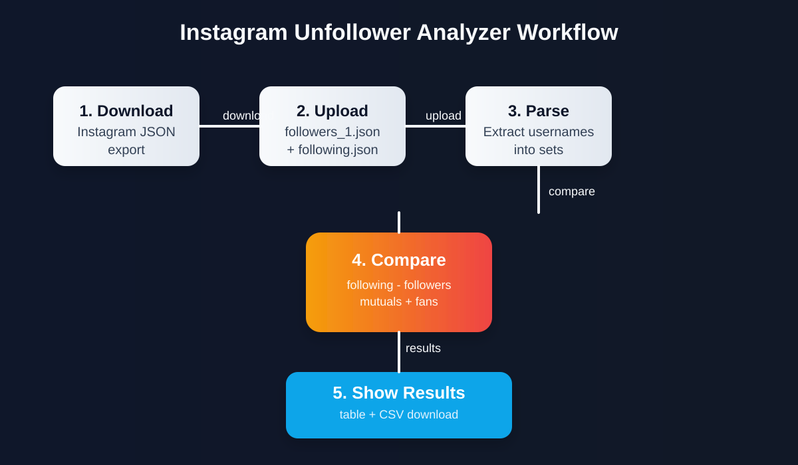

# Instagram Unfollower Analyzer

A simple Streamlit app that compares your Instagram follower and following exports and shows who you follow but who does not follow you back.

## Features

- Upload your Instagram JSON export files
- Compare followers vs following
- Show:
  - non-followers
  - mutuals
  - people who follow you
- Display results in a table with Instagram profile links
- Download the unfollowers list as CSV

## Project structure

```text
Instagram folower unfollower/
├── app.py
├── logic.py
├── README.md
├── requirements.txt
└── instagram-_yourname.../
    └── connections/
        └── followers_and_following/
            ├── followers_1.json
            └── following.json
```

## Requirements

- Python 3.9+
- Streamlit
- pandas

Install dependencies:

```bash
pip install streamlit pandas
```

## Run the app

```bash
streamlit run app.py
```

Then open the local URL shown in the terminal, usually:

```text
[text](https://instagramunfolloweranalyzer-e82ph7wzp8fa5nl32becva.streamlit.app/)
```

## Instagram JSON files to upload

You need the exported Instagram data files from the downloaded archive:

- `followers.json`
- `following.json`

These are usually located in:

```text
instagram-_yourname.../connections/followers_and_following/
```

## How it works

The app loads the JSON files, extracts usernames, and compares the two sets:

- `following - followers` = people you follow who do not follow you back
- `following ∩ followers` = mutual followers
- `followers - following` = people following you who you do not follow

## Project workflow diagram



## Notes

- The app expects Instagram export JSON files in the standard format generated by Meta/Instagram data download.

- Time range where you want the unfollow count may differ, for early data download a full json file which include all the years from instagram.

- If the JSON structure is different or incomplete, the app may show an error and ask you to upload the correct files.

## License

This project is for personal use and educational purposes.
